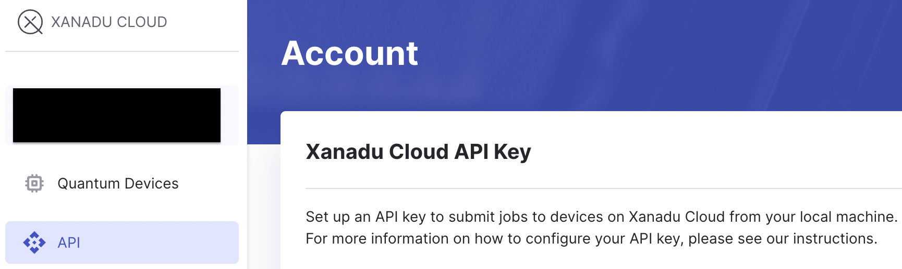
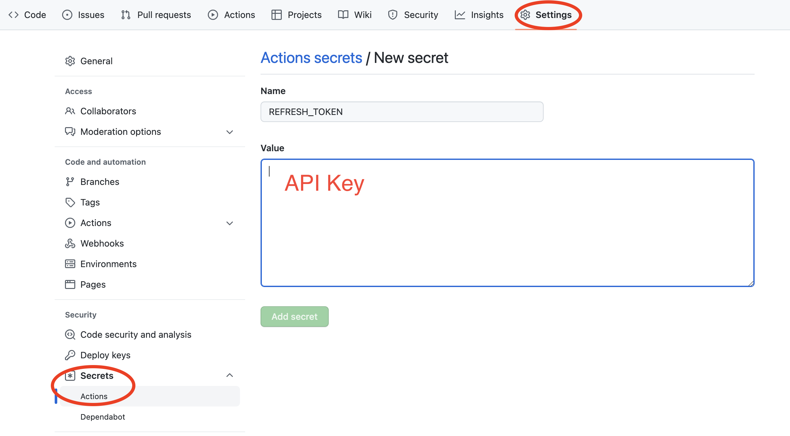

# GM! Quantum Advantage

## How to use

1. Fork this repository

2. Click on the Actions tab of the Forked Repository and enable it

3. Register to [Xanadu Cloud](https://cloud.xanadu.ai/) and get API Key

4. Go to Settings → Secrets → Actions → New repository secret and enter the API Key you just obtained with the name REFRESH_TOKEN

5. The program will run automatically at 19:00 (UTC). You can see the execution result in Actions.

6. By default, the quantum advantage demonstration is executed, but you can edit gm-quantum-advantage.py as needed and write the program you want to run.
